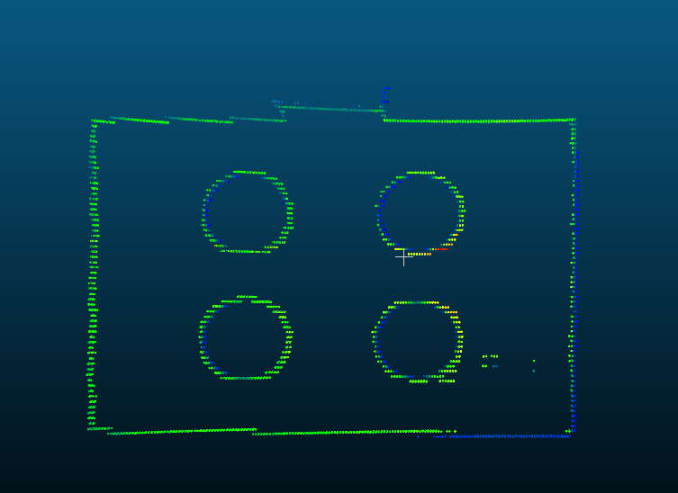
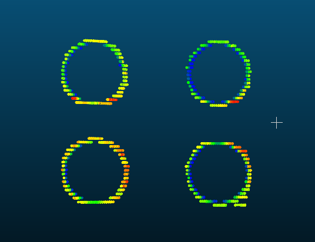
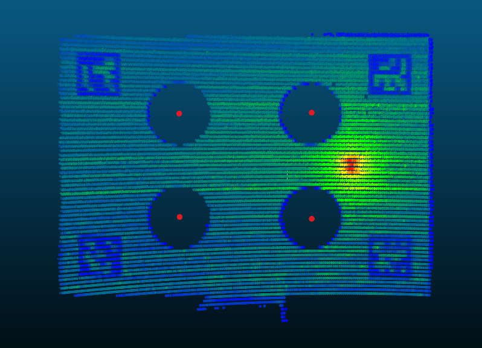
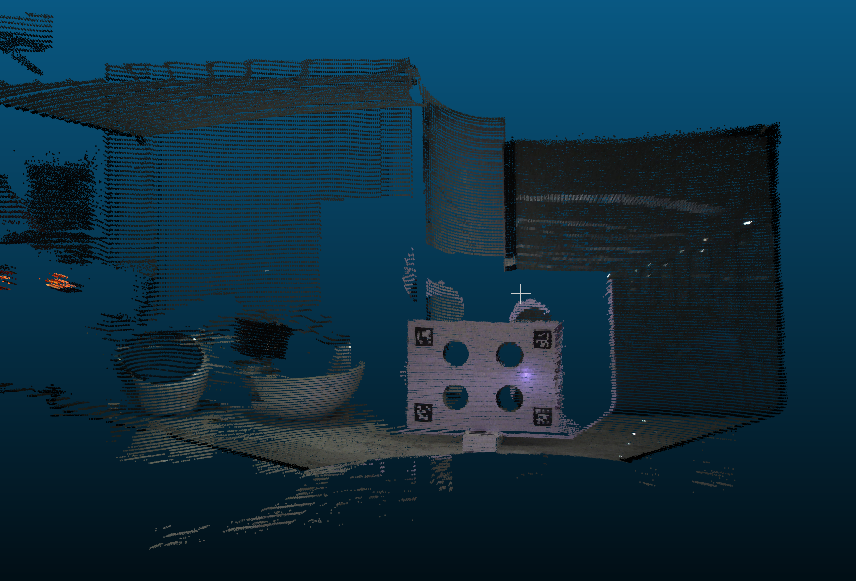
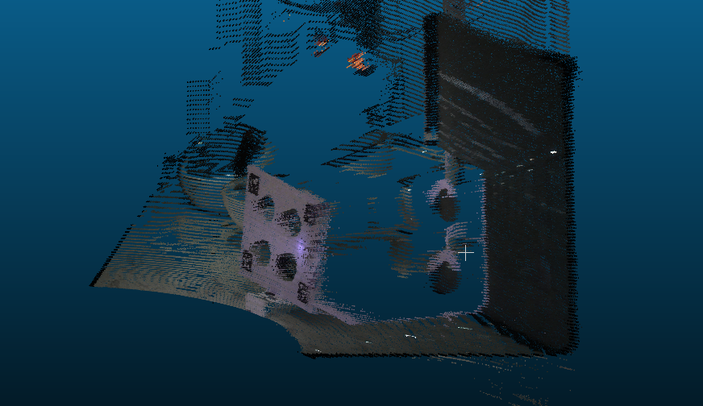

# FAST-Calib implementation without ros

This repository contains the implementation of the FAST-Calib algorithm without ROS.
The .bag data is pre-extracted as pcd pointcloud files.

Only single scene calibration part is implemented in this repository.
The multi scene calibration part is on the way.

## Official FAST-Calib repository

https://github.com/hku-mars/FAST-Calib

## Dependencies

- PCL (Point Cloud Library) ≥ 1.8
- OpenCV ≥ 3.0
- gflags: Command-line argument parsing
- glog: Logging
- yaml-cpp: YAML file parsing
- C++20 compiler support

## Preprocess Data

### Example Data

Some example data are preprocessed and can be downloaded from [here](https://1drv.ms/f/c/80b61a311192ede4/EmYjTCC-oU9OochtgXNeGEMBwUddOVwMvwWZp2L7-dGnmQ?e=Oh6Gsy).

Preprocessed data list:

- ouster

### Preprocess your data

The file `dev_tools/bag2pcd.py` is used to convert the .bag data to pcd pointcloud files, which will be saved as `.txt` file with four fields: "x", "y", "z", "intensity", "ring", "t".
This script can be run in ros docker container. You can easily download ros noetic docker image from `hub.docker.com`. Or pull directly with the following command:

```bash
docker pull ros:noetic
```

and start docker container with the following command:

```bash
docker run -it --rm --name ros_noetic -v /path/to/your/data:/workspace ros:noetic
```

place the `bag2pcd.py` file and original .bag data to `/path/to/your/data` and run the following command in docker

```bash
source /opt/ros/noetic/setup.bash
python3 bag2pcd.py --bag_file /path/to/your/data/your.bag --pointcloud_topic /ouster/points --output_dir /path/to/your/data/output
```

If you are not sure about the topic name, you can use the following command to check the topic name:

```bash
python3 bag2pcd.py --bag_file /path/to/your/data/your.bag --pointcloud_topic ""
```


## Build and Run

- Clone the Project
  
```bash
git@github.com:zeal-up/FAST-Calib_wo_ros.git
cd FAST-Calib_wo_ros
```

- Build the Project

```bash
mkdir build && cd build
cmake ..
make
```

- Usage

```bash
./my_fast_calib -cam_intrinsic_file /path/to/data/camera_pinhole.yaml --data_dir /path/to/data --output_dir /path/to/output
```

## Results

Some visualization results will be saved in the output directory.
The visualization results are shown below:

```bash
.
├── center_cloud_0.pcd          # The circle center points detected in lidar pointcloud
├── cluster_cloud_0_0.pcd       # edge cluster pointcloud
├── cluster_cloud_0_1.pcd
├── cluster_cloud_0_2.pcd
├── cluster_cloud_0_3.pcd
├── colored_cloud_0.pcd         # colored pointcloud using the final calibration transformation
├── edge_cloud_0.pcd            # edge pointcloud
├── plane_cloud_0.pcd           # clibration target plane pointcloud
├── qr_img_0.png                # QR code detection result image
├── sort_centers_lidar_0.pcd    # sorted circle center points in lidar coordinate
└── sort_centers_qr_0.pcd       # sorted circle center points in camera coordinate
```

- QR code detection result image


- Lidar Detection - edge
  


- Lidar Detection - circle edge



- Lidar Detection - targe plane with center
  


- Colored pointcloud




## Contact

Email: 1156478780@qq.com
Blog: https://zeal-up.github.io/
Github: https://github.com/zeal-up/FAST-Calib_wo_ros

## Acknowledgements

This repository is based on the official [FAST-Calib](https://github.com/hku-mars/FAST-Calib) repository.